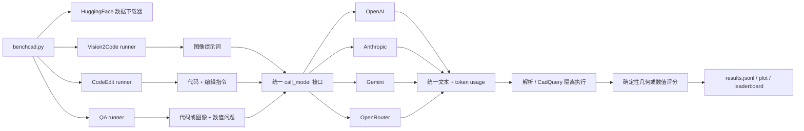

# BenchCAD 架构分析：如何评测不同 LLM

本文从代码路径出发说明 BenchCAD 如何把同一组 CAD 样本交给不同厂商、不同推理档位的模型，并把异构响应转换成可横向比较的分数。这里的“benchmark 构建”分为四层：数据与任务、统一运行编排、模型适配、确定性评分与结果汇总。

## 1. 总览



核心设计是：**模型调用层可以替换，任务提示和评分器不随模型改变**。运行器先固定样本集合，再对 `模型 × 样本`（CodeEdit 还包含 `mode`）做笛卡尔积；每个模型最终都经过同一任务流水线。

## 2. Benchmark 的任务轴

仓库用三个目录实现四个能力切面：

| 能力切面 | 输入 | 模型输出 | 评分 |
|---|---|---|---|
| Vision2Code | 标准化的四视角合成图 | CadQuery Python | 默认 64³ 体素 IoU；可选复合分数 |
| CodeEdit | 原 CadQuery 程序 + 单一编辑指令 | 修改后的 CadQuery Python | 相对原模型的归一化 IoU 改进 |
| Vision-QA | 零件渲染图 + 数值问题 | JSON 数值数组 | 逐题类型感知准确率的均值 |
| Code-QA | CadQuery 程序 + 数值问题 | JSON 数值数组 | 与 Vision-QA 相同 |

完整数据按任务从 HuggingFace 拉取，仓库只保留少量 `test_data/` 作为离线 smoke fixture。顶层命令在本地数据不足时按 `--num` 下载切片；`--num all` 用 `.full` 标记避免重复下载。`--seed` 使有限样本的随机抽样可复现，而且样本列表在模型循环之前只生成一次，所以同次运行中的各模型会看到相同样本。

## 3. 不同 LLM 如何接入同一套实验

### 3.1 统一模型协议

三个任务都只依赖：

```python
call_model(model, system, user_text, image_paths, max_tokens, timeout)
```

返回值统一为 `(text, usage)`；`usage` 统一成 `prompt_tokens`、`completion_tokens`、`reasoning_tokens` 和 `total_tokens`。模型 ID 前缀决定路由：

- `gpt-*`、`o1*`、`o3*` → OpenAI；
- `claude-*` → Anthropic；
- `gemini-*` → Google Gemini；
- `openrouter/*` → OpenRouter 的 OpenAI-compatible endpoint。

适配器负责消化厂商差异：图像的 base64/bytes 表示、system prompt 字段、SDK 响应格式、超时和 token usage。这样任务 runner 不含厂商分支，新增模型通常只需给出可路由的 model ID；新增厂商则需要实现同样的 `generate(...) -> (text, usage)` 契约并扩展 dispatcher。

### 3.2 模型变体也是实验变量

model ID 后缀把“同一基础模型的推理配置”编码进实验身份：

- OpenAI：`:reasoning=minimal|low|medium|high|xhigh|max`；
- Anthropic：`:reasoning=medium|high`，映射到 extended-thinking budget；
- Gemini：`:thinking=off`；
- OpenRouter：`:reasoning=<effort|整数|off>`。

结果以完整 model ID 分桶，因此不同 reasoning tier 不会互相覆盖。适配器还会为推理模型提高输出 token 下限，避免推理 token 吃完代码输出预算。需要注意，这些后缀是**显式实验条件**，并非所有厂商都具备完全等价的推理控制，所以报告结果时应保留完整 model ID，而不能只写基础模型名。

### 3.3 可比性控制

- 各模型收到同一 task prompt 和同一 record 内容；旧式非推理模型在支持时使用 `temperature=0`，Gemini 同样使用 `temperature=0`。
- 每次调用共享配置中的 `max_tokens`、模型调用 `timeout`；代码生成任务还共享 CadQuery `exec_timeout`。
- API 失败、无法解析代码、执行失败或评分失败都有明确状态，并按零分进入该记录，而不是静默丢弃困难样本。
- token 与估算成本和得分一起落盘，便于同时比较质量、延迟和成本。价格表未知或 provider 不返回 usage 时，成本保留为 `null`，不会臆造。

## 4. 三条评分流水线

### 4.1 Vision2Code：视觉到可执行几何

1. 从 GT STEP 懒加载渲染固定相机的 2×2 四视图；包围盒中心移到 `[0.5, 0.5, 0.5]`，最长边缩放为 1。
2. 要求模型只返回一个 Python fenced block、导入 CadQuery，并把最终实体放入 `result`。
3. 提取代码；在独立子进程运行，并强制或补充 STEP 导出。超时、非零退出码、无 STEP 都标为 `exec_fail`。
4. 默认把生成 STEP 与 GT STEP 都 tessellate、按包围盒归一化、填充到 64³ 体素（外加 padding），计算 `|A∩B| / |A∪B|`。归一化消除了绝对尺寸差异，但仍要求正确形状与世界坐标方向。
5. 可选复合分数：

   `0.60·IoU + 0.20·essential-op + 0.10·Feature-F1 + 0.05·Chamfer-score + 0.05·Hausdorff-score`

   `essential-op` 来自按 family 定义的关键 CadQuery 操作，Feature-F1 检查孔、圆角、倒角；Chamfer/Hausdorff 在归一化表面采样上计算。没有 family 关键操作定义时，移除该 0.20 项并把其余权重重新缩放到 `[0,1]`。

### 4.2 CodeEdit：衡量“相对原程序的修复增益”

模型得到原始代码与只针对一个 feature 的自然语言指令，提示明确要求最小修改。生成代码也走相同的“提取 → 子进程执行 → STEP”路径。评分不是裸 IoU，而是：

`norm_iou = clip((model_iou - baseline_iou) / (1 - baseline_iou), 0, 1)`

其中 `baseline_iou` 是原始未编辑零件相对目标零件的 IoU。这个归一化回答的是“模型弥合了多少原始几何与目标几何之间的差距”，使原始编辑难度不同的样本更可比较；没有超过 baseline 的修改得 0，达到目标得 1。

### 4.3 QA：解析受约束的数值答案

QA 用同一数据结构支持 `code`、`img`、`both` 三种输入模式。模型必须返回与问题数相等的 JSON 数值数组。解析器可以容忍前导文字或 Markdown fence，但数组长度不对、元素不是数值都算 `parse_fail`。

- `integer/count/boolean/bool`：精确匹配；
- 尺寸、比例及其他类型：先检查符号，再计算 `min(|pred|, |gt|) / max(|pred|, |gt|)`；
- 0 只与 0 匹配；记录分数是所有题目的均值。

这种 symmetric-ratio 指标不依赖 LLM judge，且不会因为数值量纲大而放大绝对误差。

## 5. 结果、重跑与排行榜

每条流水线都保存原始/提取后的产物、状态、延迟、usage、成本和分数到输出目录，并维护聚合的 `results.jsonl`：

- Vision2Code、QA 以 `(model, record_id)` 覆盖旧记录；
- CodeEdit 以 `(mode, model, record_id)` 覆盖旧记录；
- 重跑同一实验单元不会产生重复行，改变完整 model ID 会产生新的比较组；
- plot 只消费已有结果，不再调用模型；
- 公共 leaderboard 的唯一数据源是 `leaderboard.json`，`tools/build_leaderboard.py` 生成 Markdown。项目要求榜单分数从 raw predictions 重新评分，而不是信任自报数字。

## 6. 一次多模型实验的真实控制流

```text
benchcad.py
  ├─ 解析 --task/--num/--seed/--model/--score
  ├─ 确保每个任务的数据量足够
  └─ 对每个任务启动 main.py
       ├─ 读取 YAML 与 records.jsonl
       ├─ 过滤/抽样一次 records
       └─ for model in models:
            └─ for record in records:
                 ├─ 构造该任务固定的 prompt
                 ├─ dispatcher → provider adapter
                 ├─ 规范化文本与 usage
                 ├─ 解析（必要时执行 CadQuery）
                 ├─ 用 GT 做确定性评分
                 └─ upsert results.jsonl
```

因此，多模型 benchmark 的本质不是为每个 LLM 复制一份评测代码，而是把 **model ID 当作矩阵的一条轴**，在共享数据、共享 prompt builder、共享失败规则和共享 scorer 上循环执行。

## 7. 解读结果时的重要边界

1. **IoU 的尺寸不敏感是设计选择。** STEP 在评分前按各自包围盒归一化，因此 Vision2Code 更偏重形状与拓扑，而不是恢复绝对毫米尺度；方向仍然敏感。
2. **复合指标含代码表面特征。** essential-op 和部分 Feature-F1 会读取生成代码，几何相似但实现方式不同可能得到不同分数；默认裸 IoU 没有这个因素。
3. **随机表面采样影响复合距离项。** Chamfer/Hausdorff 使用采样点，严格 bit-for-bit 复现应额外固定 NumPy/Trimesh 随机状态；默认 IoU 与 QA 评分不受这项影响。
4. **API 是外部变量。** 相同 model alias 可能在厂商侧更新。可审计实验应记录运行日期、完整 model ID、配置、raw output、依赖锁文件和 provider 返回的 usage。
5. **串行而非并行。** 当前 runner 按模型和记录顺序执行，降低并发限流干扰，但大规模全量、多模型实验耗时会线性增长。

## 8. 扩展一个新模型的检查表

1. 若现有 provider 已支持该模型，直接把完整 ID 加入 YAML `models` 或传给 `--model`。
2. 若是新 provider，实现 adapter 的统一参数与 `(text, usage)` 返回值，并在 `_route`/`call_model` 添加路由。
3. 同时验证纯文本（CodeEdit/Code-QA）与图片（Vision2Code/Vision-QA）的 content 编码。
4. 将 provider token 字段映射到统一 usage schema；推理 token 应计入 completion token。
5. 在 `pricing.yaml` 添加可核查价格，否则允许 `cost_usd: null`。
6. 用所有任务的 `test_data` 做 smoke test，再以相同 `--seed` 和记录数运行候选模型与对照模型。
7. 保存 raw predictions；排行榜提交应让维护方通过 scorer 重算。

